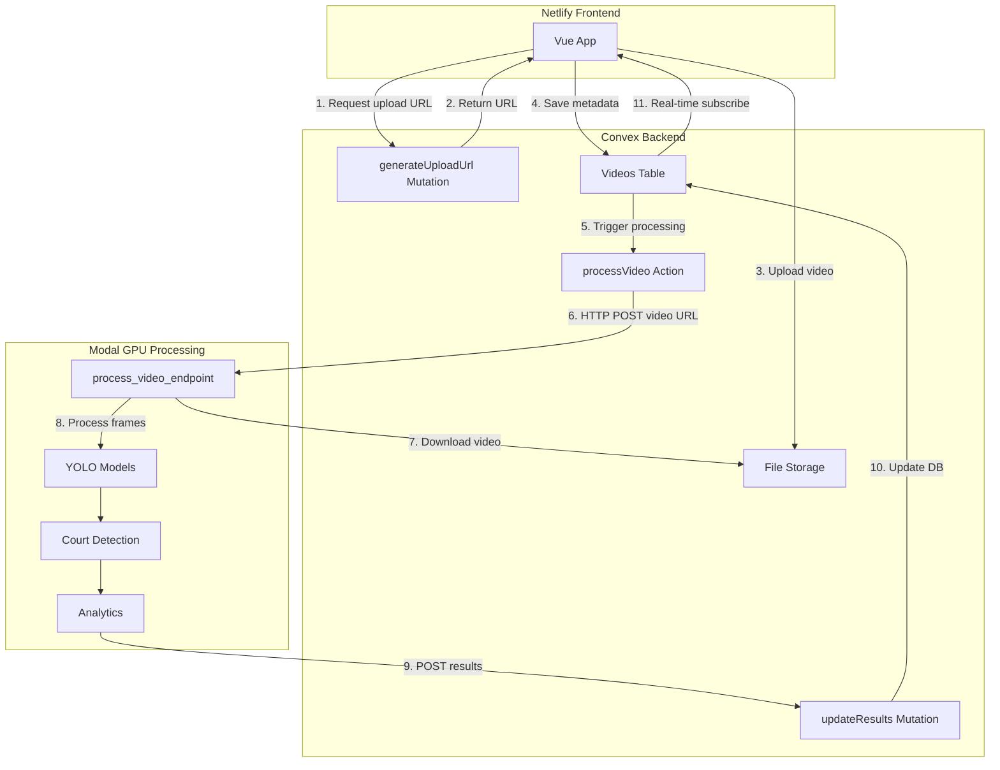

# Convex + Modal Integration Architecture

## Overview

This document outlines the architecture for integrating Convex (storage + real-time DB) with Modal (GPU processing) for the Badminton Tracker application.

## Architecture Diagram



## Data Flow

### Step 1: Video Upload (Frontend → Convex)

```typescript
// Frontend Vue component
async function uploadVideo(file: File) {
  // Get temporary upload URL
  const uploadUrl = await convex.mutation(api.videos.generateUploadUrl)
  
  // Upload directly to Convex storage
  const response = await fetch(uploadUrl, {
    method: "POST",
    headers: { "Content-Type": file.type },
    body: file
  })
  const { storageId } = await response.json()
  
  // Create video record in DB
  const videoId = await convex.mutation(api.videos.createVideo, {
    storageId,
    filename: file.name,
    size: file.size
  })
  
  // Trigger processing
  await convex.action(api.videos.processVideo, { videoId })
  
  return videoId
}
```

### Step 2: Convex Schema

```typescript
// convex/schema.ts
import { defineSchema, defineTable } from "convex/server"
import { v } from "convex/values"

export default defineSchema({
  videos: defineTable({
    // File storage
    storageId: v.id("_storage"),
    filename: v.string(),
    size: v.number(),
    
    // Processing status
    status: v.union(
      v.literal("uploaded"),
      v.literal("processing"),
      v.literal("completed"),
      v.literal("failed")
    ),
    progress: v.optional(v.number()),
    error: v.optional(v.string()),
    
    // Analysis results
    results: v.optional(v.object({
      duration: v.number(),
      fps: v.number(),
      totalFrames: v.number(),
      processedFrames: v.number(),
      videoWidth: v.number(),
      videoHeight: v.number(),
      players: v.array(v.any()),
      shuttle: v.optional(v.any()),
      courtDetection: v.optional(v.any()),
    })),
    
    // Processed video storage
    processedVideoStorageId: v.optional(v.id("_storage")),
    
    // Metadata
    createdAt: v.number(),
    completedAt: v.optional(v.number()),
  })
})
```

### Step 3: Convex Mutations & Actions

```typescript
// convex/videos.ts
import { action, mutation, query } from "./_generated/server"
import { v } from "convex/values"

// Generate upload URL for client
export const generateUploadUrl = mutation({
  args: {},
  handler: async (ctx) => {
    return await ctx.storage.generateUploadUrl()
  },
})

// Create video record after upload
export const createVideo = mutation({
  args: {
    storageId: v.id("_storage"),
    filename: v.string(),
    size: v.number(),
  },
  handler: async (ctx, args) => {
    const videoId = await ctx.db.insert("videos", {
      storageId: args.storageId,
      filename: args.filename,
      size: args.size,
      status: "uploaded",
      createdAt: Date.now(),
    })
    return videoId
  },
})

// Get video by ID (real-time query)
export const getVideo = query({
  args: { videoId: v.id("videos") },
  handler: async (ctx, { videoId }) => {
    return await ctx.db.get(videoId)
  },
})

// Trigger Modal processing
export const processVideo = action({
  args: { videoId: v.id("videos") },
  handler: async (ctx, { videoId }) => {
    // Get video record
    const video = await ctx.runQuery(api.videos.getVideo, { videoId })
    if (!video) throw new Error("Video not found")
    
    // Get temporary URL for Modal to download
    const videoUrl = await ctx.storage.getUrl(video.storageId)
    if (!videoUrl) throw new Error("Failed to get video URL")
    
    // Update status to processing
    await ctx.runMutation(api.videos.updateStatus, {
      videoId,
      status: "processing",
      progress: 0,
    })
    
    // Call Modal endpoint
    const modalUrl = process.env.MODAL_ENDPOINT_URL!
    const response = await fetch(`${modalUrl}/process`, {
      method: "POST",
      headers: { "Content-Type": "application/json" },
      body: JSON.stringify({
        videoId,
        videoUrl,
        callbackUrl: process.env.CONVEX_SITE_URL + "/updateResults",
      }),
    })
    
    if (!response.ok) {
      await ctx.runMutation(api.videos.updateStatus, {
        videoId,
        status: "failed",
        error: "Failed to start processing",
      })
      throw new Error("Modal processing failed to start")
    }
  },
})

// Update processing status (called by Modal)
export const updateStatus = mutation({
  args: {
    videoId: v.id("videos"),
    status: v.union(
      v.literal("uploaded"),
      v.literal("processing"),
      v.literal("completed"),
      v.literal("failed")
    ),
    progress: v.optional(v.number()),
    error: v.optional(v.string()),
  },
  handler: async (ctx, args) => {
    await ctx.db.patch(args.videoId, {
      status: args.status,
      progress: args.progress,
      error: args.error,
    })
  },
})

// Update with final results (called by Modal)
export const updateResults = mutation({
  args: {
    videoId: v.id("videos"),
    results: v.any(),
    processedVideoStorageId: v.optional(v.id("_storage")),
  },
  handler: async (ctx, args) => {
    await ctx.db.patch(args.videoId, {
      status: "completed",
      progress: 100,
      results: args.results,
      processedVideoStorageId: args.processedVideoStorageId,
      completedAt: Date.now(),
    })
  },
})
```

### Step 4: Modal Processing

```python
# modal_app.py
import modal
import httpx
import uuid
from pathlib import Path

app = modal.App("badminton-processor")

# Create volume for temporary storage
vol = modal.Volume.from_name("badminton-videos", create_if_missing=True)

# Image with dependencies
image = (
    modal.Image.debian_slim(python_version="3.11")
    .pip_install(
        "fastapi[standard]",
        "opencv-python-headless",
        "numpy",
        "ultralytics",
        "httpx",
    )
)

@app.function(
    gpu="T4",
    timeout=1800,  # 30 minutes
    image=image,
    volumes={"/data": vol},
)
@modal.web_endpoint(method="POST")
async def process_video(request: dict):
    """
    Process video from Convex storage.
    
    Request format:
    {
        "videoId": "...",
        "videoUrl": "https://convex.cloud/storage/...",
        "callbackUrl": "https://convex.site/updateResults"
    }
    """
    video_id = request["videoId"]
    video_url = request["videoUrl"]
    callback_url = request["callbackUrl"]
    
    # Download video from Convex
    print(f"Downloading video {video_id}...")
    video_path = f"/data/{video_id}.mp4"
    
    async with httpx.AsyncClient(timeout=300.0) as client:
        response = await client.get(video_url)
        response.raise_for_status()
        
        with open(video_path, "wb") as f:
            f.write(response.content)
    
    print(f"Video downloaded: {video_path}")
    
    # Import existing processing logic
    from backend.main import process_video_internal
    
    # Process video
    print("Starting video processing...")
    results = await process_video_internal(
        video_path=Path(video_path),
        video_id=video_id,
        callback_url=callback_url,
    )
    
    # Upload processed video back to Convex (if needed)
    processed_video_path = f"/data/{video_id}_processed.mp4"
    processed_storage_id = None
    
    if Path(processed_video_path).exists():
        # Get upload URL from Convex
        upload_response = await client.post(
            f"{callback_url}/generateUploadUrl"
        )
        upload_url = await upload_response.json()
        
        # Upload processed video
        with open(processed_video_path, "rb") as f:
            upload_result = await client.post(
                upload_url,
                content=f.read(),
                headers={"Content-Type": "video/mp4"},
            )
            processed_storage_id = (await upload_result.json())["storageId"]
    
    # Send results back to Convex
    await client.post(
        callback_url,
        json={
            "videoId": video_id,
            "results": results,
            "processedVideoStorageId": processed_storage_id,
        },
    )
    
    # Cleanup
    Path(video_path).unlink(missing_ok=True)
    Path(processed_video_path).unlink(missing_ok=True)
    vol.commit()
    
    return {"status": "completed", "videoId": video_id}


async def process_video_internal(video_path: Path, video_id: str, callback_url: str):
    """
    Internal processing function (adapts existing backend/main.py logic).
    Sends progress updates to Convex during processing.
    """
    import cv2
    import asyncio
    from ultralytics import YOLO
    
    # Progress update helper
    async def update_progress(progress: float):
        async with httpx.AsyncClient() as client:
            await client.post(
                f"{callback_url}/updateStatus",
                json={
                    "videoId": video_id,
                    "status": "processing",
                    "progress": progress,
                },
            )
    
    # Load models
    pose_model = YOLO("yolo26n-pose.pt")
    
    # Open video
    cap = cv2.VideoCapture(str(video_path))
    fps = cap.get(cv2.CAP_PROP_FPS)
    total_frames = int(cap.get(cv2.CAP_PROP_FRAME_COUNT))
    
    # Process frames...
    # (Adapt existing logic from backend/main.py:process_video)
    
    # Send progress updates periodically
    for frame_idx in range(0, total_frames, 10):
        progress = (frame_idx / total_frames) * 100
        await update_progress(progress)
    
    # Return results
    return {
        "duration": total_frames / fps,
        "fps": fps,
        "totalFrames": total_frames,
        # ... other results
    }
```

### Step 5: Frontend Integration

```typescript
// src/composables/useConvex.ts
import { ConvexReactClient } from "convex/react"
import { api } from "../../convex/_generated/api"

const convex = new ConvexReactClient(import.meta.env.VITE_CONVEX_URL!)

export function useConvex() {
  return { convex, api }
}

// src/components/VideoUpload.vue
<script setup lang="ts">
import { ref } from 'vue'
import { useConvex } from '@/composables/useConvex'
import { useQuery, useMutation, useAction } from '@convex-vue/core'

const { convex, api } = useConvex()
const uploadProgress = ref(0)
const videoId = ref<string | null>(null)

// Real-time video query
const video = useQuery(
  api.videos.getVideo,
  () => videoId.value ? { videoId: videoId.value } : "skip"
)

async function handleUpload(file: File) {
  // Generate upload URL
  const uploadUrl = await convex.mutation(api.videos.generateUploadUrl)
  
  // Upload file
  const response = await fetch(uploadUrl, {
    method: "POST",
    headers: { "Content-Type": file.type },
    body: file,
  })
  const { storageId } = await response.json()
  
  // Create video record
  videoId.value = await convex.mutation(api.videos.createVideo, {
    storageId,
    filename: file.name,
    size: file.size,
  })
  
  // Trigger processing
  await convex.action(api.videos.processVideo, {
    videoId: videoId.value,
  })
}

// Watch for progress updates (automatic reactivity!)
watch(() => video.value?.progress, (progress) => {
  if (progress !== undefined) {
    uploadProgress.value = progress
  }
})
</script>
```

## Key Implementation Details

### Convex Benefits
1. **Automatic real-time updates** - No WebSocket needed, Convex handles subscriptions
2. **Type-safe queries** - Full TypeScript integration
3. **Built-in authentication** - Easy to add user auth later
4. **Serverless** - No backend deployment needed

### Modal Benefits
1. **GPU acceleration** - T4 GPU for fast YOLO inference
2. **Scales to zero** - Only pay for processing time
3. **Python ecosystem** - Use existing OpenCV/YOLO code
4. **Timeout handling** - Automatic retries and error handling

### File Flow
1. Frontend uploads to Convex (up to 1GB)
2. Convex generates temporary URL for Modal to download
3. Modal processes and uploads result back to Convex
4. Frontend gets real-time updates via Convex reactivity

### Cost Considerations
- **Convex**: Free tier (1GB storage, reactive queries)
- **Modal**: Pay per GPU minute (~$0.60/hr for T4)
- **Netlify**: Free tier (hosting only)

## Environment Variables

### Convex (`.env.local`)
```bash
VITE_CONVEX_URL=https://your-project.convex.cloud
```

### Modal (`modal_secrets`)
```bash
modal secret create convex-secrets \
  CONVEX_SITE_URL=https://your-project.convex.site
```

## Deployment Steps

1. **Deploy Convex**
   ```bash
   npx convex dev  # Local development
   npx convex deploy  # Production
   ```

2. **Deploy Modal**
   ```bash
   modal deploy modal_app.py
   ```

3. **Deploy Frontend (Netlify)**
   - Set `VITE_CONVEX_URL` environment variable
   - Deploy from GitHub

## Next Steps

1. Set up Convex project
2. Implement Convex schema and mutations
3. Adapt existing Modal processing code
4. Update Vue frontend to use Convex
5. Test end-to-end flow
6. Deploy to production
